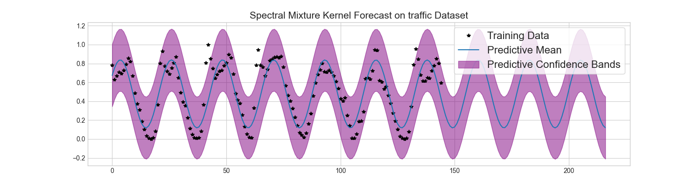

# Deep Kernel Learning

This repo implements several flavors of Gaussian processes with deep kernels, first introduced in [Deep Kernel Learning](https://arxiv.org/abs/1511.02222) by Wilson et al. (2015).  

- [Deep Kernel Learning (2015)](https://arxiv.org/abs/1511.02222) 
- [Learning Scalable Deep Kernels with Recurrent Structure (2016)](https://arxiv.org/abs/1610.08936)
- [Semi-supervised Deep Kernel: Regression with Unlabeled Data by Minimizing Predictive Variance (2018)](https://papers.nips.cc/paper/2018/file/9d28de8ff9bb6a3fa41fddfdc28f3bc1-Paper.pdf)
- [Deep Spectral Kernel Learning (2019)](https://www.ijcai.org/Proceedings/2019/0558.pdf)
- [Convolutional Spectral Kernel Learning (2020)](https://arxiv.org/pdf/2002.12744.pdf)